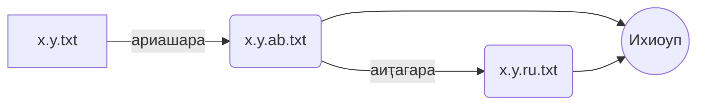

# Оцифровка абхазского языка!
Общая цель – расширение использования абхазского языка в цифровом пространстве
Конкретная цель - предоставить набор данных с открытым доступом, который можно использовать для внедрения новых технологии на абхазском языке.

Проблема заключается в отсутствии открытого абхазского текста в нужном формате, чтобы использовать его в задачах НЛП (обработки естественного языка).
К таким задачам относятся, среди прочего:
-   автоматический перевод текстов;
-   преобразование речи в текст,
-   преобразование текста в речь.
 
Эти задачи позволят языку развиваться и идти в ногу с новейшими технологиями и гаджетами (т.е. Локализация приложений, перевод документов, голосовые помощники).

Наша группа свяжется с авторами, чтобы [опубликовать их текстовые материалы](https://github.com/danielinux7/abkhazian-books#readme) в открытом доступе, затем переформатирует текст в предложения, а также переведет предложения на русском языке, подходящие для обучения искусственному интеллекту.

**Наш проект затрагивает такие тематические направления, как:**
-   Право человека - Самовыражение с помощью языка - это право человека. Мы сохраняем это право, открывая путь новым технологиям.
-   Права женщин - Более половины студентов составят молодые женщины.
-   Право молодежь - студенты возраст (18-24 лет) будут непосредственными участниками проекта, за участие в нем они будут получат гонорар.
-   Люди с ограниченными возможностями: в конечном итоге наш проект открывает возможности для голосовых технологий на абхазском языке, таких как GPS-приложение, которое разработано для слепых, слепоглухих и слабовидящих людей.

## Мероприятие
- Выполняемые студентами задания чтобы преобразовать абхазский текст в предложения, подходящие для обучения искусственному интеллекту.
- Выполняемые студентами задания чтобы переводить абхазских предложений на русском языке, подходящий для обучения искусственному интеллекту.

**Рабочий процесс:**

x: ID, идентификатор книги в [таблице](https://github.com/danielinux7/abkhazian-books#readme)
y: в какой части книги
ab: абхазский текст
ru: русский текст
